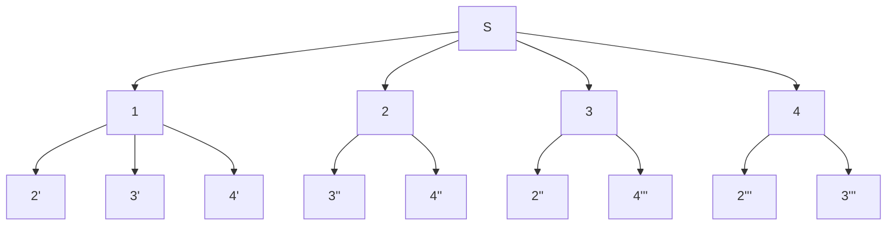
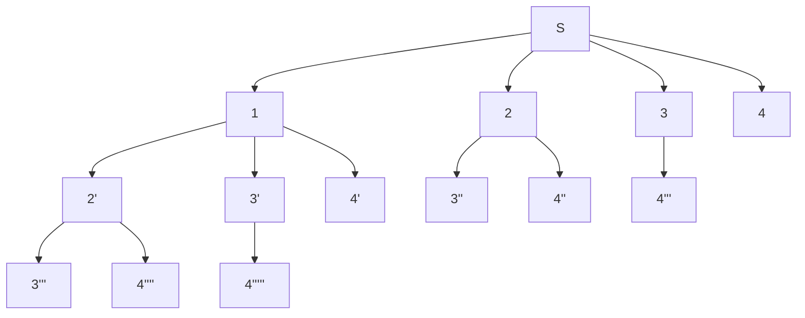

# [字符串的排列](https://www.nowcoder.com/practice/fe6b651b66ae47d7acce78ffdd9a96c7?tpId=13&tqId=11180&tPage=2&rp=2&ru=/ta/coding-interviews&qru=/ta/coding-interviews/question-ranking)

## 题目描述

输入一个字符串,按字典序打印出该字符串中字符的所有排列。例如输入字符串abc,则打印出由字符a,b,c所能排列出来的所有字符串abc,acb,bac,bca,cab和cba。

## 输入描述:

```
输入一个字符串,长度不超过9(可能有字符重复),字符只包括大小写字母。
```


```java
class Solution {
public:
    
    vector<string> result;
    
    /* 排列树的典型应用 */
    vector<string> Permutation(string str) {
        int length = str.length();
        if(length == 0)
            return result;
        Permutation(0, length, str);
        sort(result.begin(), result.end());
        return result;
    }
    
    void Permutation(int i, int length, string str) {
        if(i == length)
        {
            result.push_back(str);
        }
        else
        {
            for(int j = i; j < length; ++j)
            {
                if(j != i && str[j] == str[i])
                    continue;
                swap(str[i], str[j]);
                Permutation(i + 1, length, str);
                swap(str[i], str[j]);
            }
        }
    }
};s
```

```c++
class Solution {
public:
    vector<string> permutation(string s) {
        dfs(s, 0);
        return res;
    }
private:
    vector<string> res;
    void dfs(string s, int x) {
        if(x == s.size() - 1) {
            res.push_back(s);                       // 添加排列方案
            return;
        }
        set<int> st;
        for(int i = x; i < s.size(); i++) {
            if(st.find(s[i]) != st.end()) continue; // 重复，因此剪枝
            st.insert(s[i]);
            swap(s[i], s[x]);                       // 交换，将 s[i] 固定在第 x 位
            dfs(s, x + 1);                          // 开启固定第 x + 1 位字符,
            swap(s[i], s[x]);                       // 恢复交换
        }
    }
};

作者：jyd
链接：https://leetcode-cn.com/problems/zi-fu-chuan-de-pai-lie-lcof/solution/mian-shi-ti-38-zi-fu-chuan-de-pai-lie-hui-su-fa-by/
来源：力扣（LeetCode）
著作权归作者所有。商业转载请联系作者获得授权，非商业转载请注明出处。
```

==全排列低增的是x==

回溯算法和dfs算法，这里应该算是回溯，回溯是dfs算法的一种，由于需要考虑重复的元素，隐私使用set去重

注意下剪枝的意思，可以在遍历中看维continue就好

下边是子集，两者的区别就在与  返回的条件，子集是无条件返回，全排列是到根节点才返回

因此==子集==因为前面是无条件返回，因此返回条件是设置在循环结束之后==，因此循环想要结束，dfs中递增的是i==

```c++
class Solution {
public:
// result = []
// def backtrack(路径, 选择列表):
//     if 满足结束条件:
//         result.add(路径)
//         return
//     for 选择 in 选择列表:
//         做选择
//         backtrack(路径, 选择列表)
//         撤销选择
    vector<vector<int>> subsets(vector<int>& nums) 
    {
        dfs(nums,0);
        return res;

    }
private:
    vector<vector<int>> res;
    vector<int> track;
    void dfs(vector<int>& nums,int x)
    {
        res.push_back(track);
        for(int i=x;i<nums.size();i++)
        {
            track.push_back(nums[i]);
            dfs(nums,i+1);//重点递增是i
            track.pop_back();
        }

    }
};
```

排列

```c++
private:
    vector<vector<int>> ans;
    vector<int> track;
    void dfs(int n,int k,int l)//增加一个l用来递归调用的参数
    {
        if(k==track.size())
        {
            ans.push_back(track);
            return;
        }
        for(int i=l;i<=n;++i)
        {
            track.push_back(i);
            dfs(n,k,i+1);
            track.pop_back();
        }

    }
```

自己原来写的

```c++
vector<vector<int>> ans;
    vector<int> track;
    void dfs(int n,int k,int l)//增加一个l用来递归调用的参数
    {
        if(l==k)     //返回条件  k=track.size();
        {
            ans.push_back(track);
            return;
        }
        for(int i=l;i<k;++i)  //注意这里从1到n都能取到，因此这里遍历使用的是等号
        {
            track.push_back(i);
            dfs(n,k,l+1);     //返回的是i+1
            track.pop_back();
        }

    }  
```

可以画图来看出这个的区别，l和i

比如取n=4,k=2；

这个是以l+1开头的   意思是以第一个数一座左边第一个数开始加一开始算起

第二个是以i+1开始计算






